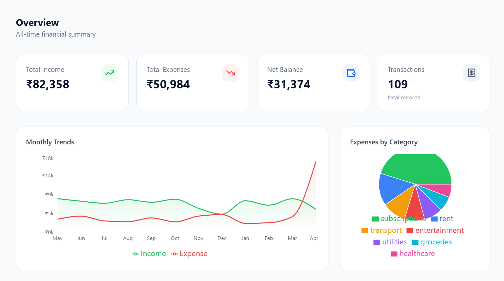
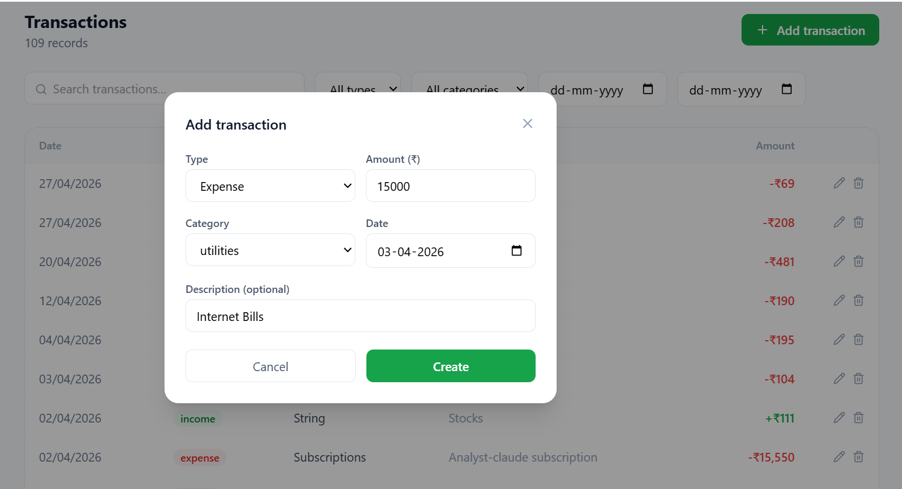
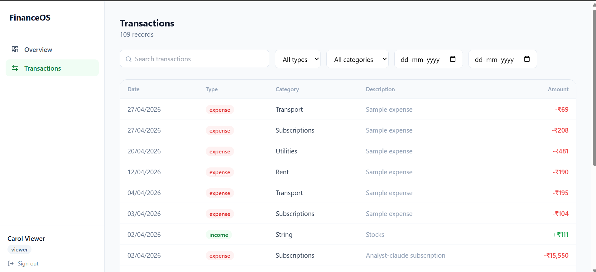
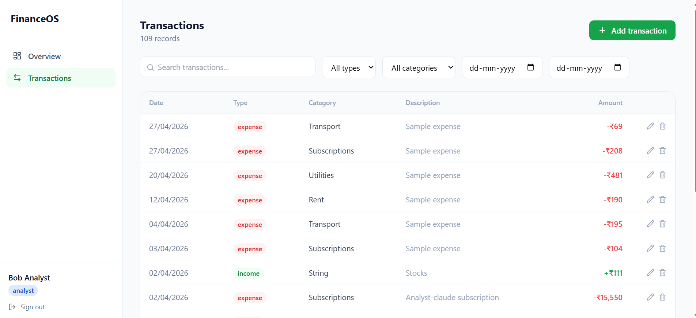
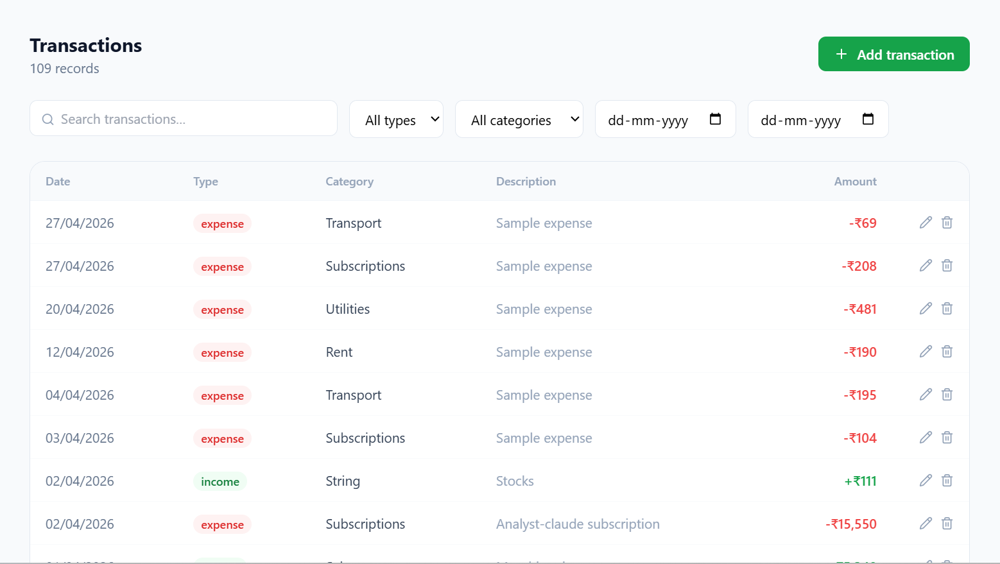
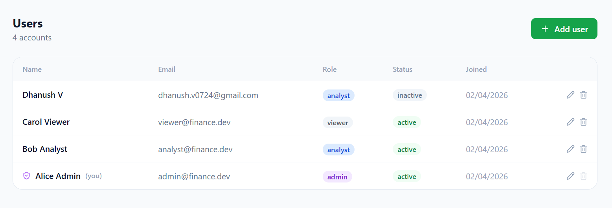

# Finance Dashboard

A full-stack finance management system with role-based access control.

**Stack:** FastAPI · SQLite · SQLAlchemy · Next.js 14 · Tailwind CSS · Recharts

---

## Quick Start

### Backend

```bash
cd backend
python -m venv venv
source venv/bin/activate          # Windows: venv\Scripts\activate
pip install -r requirements.txt


python -m app.seed                # creates DB + seeds users + 12 months of data
uvicorn app.main:app --reload --port 8000
```

API is live at `http://localhost:8000`
Swagger docs at `http://localhost:8000/docs`

### Frontend

```bash
cd frontend
npm install


npm run dev
```

App is live at `http://localhost:3000`

---

## Demo Accounts

| Email | Password | Role |
|---|---|---|
| admin@finance.dev | admin123 | Admin |
| analyst@finance.dev | analyst123 | Analyst |
| viewer@finance.dev | viewer123 | Viewer |

---

## Access Control

| Action | Viewer | Analyst | Admin |
|---|:---:|:---:|:---:|
| View dashboard summary | ✅ | ✅ | ✅ |
| List / view transactions | ✅ | ✅ | ✅ |
| Create transactions | ❌ | ✅ | ✅ |
| Edit own transactions | ❌ | ✅ | ✅ |
| Edit any transaction | ❌ | ❌ | ✅ |
| Delete own transactions | ❌ | ✅ | ✅ |
| Delete any transaction | ❌ | ❌ | ✅ |
| List / view users | ❌ | ❌ | ✅ |
| Create / edit / delete users | ❌ | ❌ | ✅ |

---

## API Reference

### Auth

| Method | Path | Description |
|---|---|---|
| POST | `/auth/login` | Login, receive JWT |
| POST | `/auth/register` | Self-register (viewer role) |
| GET | `/auth/me` | Current user profile |

### Users _(admin only)_

| Method | Path | Description |
|---|---|---|
| GET | `/users` | List all users |
| POST | `/users` | Create user with any role |
| GET | `/users/{id}` | Get user by ID |
| PATCH | `/users/{id}` | Update name / role / status |
| DELETE | `/users/{id}` | Permanently delete user |

### Transactions

| Method | Path | Description |
|---|---|---|
| GET | `/transactions` | List with filters + pagination |
| POST | `/transactions` | Create record _(analyst+)_ |
| GET | `/transactions/{id}` | Get by ID |
| PATCH | `/transactions/{id}` | Update _(analyst+, own or admin)_ |
| DELETE | `/transactions/{id}` | Soft delete _(analyst+, own or admin)_ |

**GET /transactions query params:**

| Param | Type | Description |
|---|---|---|
| `type` | `income` \| `expense` | Filter by type |
| `category` | string | Filter by category |
| `date_from` | ISO datetime | Start of date range |
| `date_to` | ISO datetime | End of date range |
| `search` | string | Full-text on description + category |
| `page` | int (default 1) | Page number |
| `page_size` | int (default 20, max 100) | Items per page |

### Dashboard

| Method | Path | Description |
|---|---|---|
| GET | `/dashboard/summary` | Totals, trends, category breakdowns, recent activity |

---

## Project Structure

```
finance-dashboard/
├── backend/
│   ├── requirements.txt
│   └── app/
│       ├── main.py               # FastAPI app, CORS, router registration
│       ├── database.py           # SQLAlchemy engine + session + get_db()
│       ├── seed.py               # Dev data seeder
│       ├── models/models.py      # ORM models: User, Transaction
│       ├── schemas/schemas.py    # Pydantic request/response schemas
│       ├── utils/
│       │   ├── config.py         # Settings via pydantic-settings
│       │   └── auth.py           # JWT encode/decode, bcrypt hashing
│       ├── middleware/
│       │   └── auth_deps.py      # get_current_user, require_roles() factory
│       ├── services/
│       │   ├── auth_service.py   # Login logic
│       │   ├── user_service.py   # User CRUD
│       │   ├── transaction_service.py  # Transaction CRUD + filters
│       │   └── dashboard_service.py    # Aggregation queries
│       └── routes/
│           ├── auth.py
│           ├── users.py
│           ├── transactions.py
│           └── dashboard.py
└── frontend/
    └── src/
        ├── types/index.ts        # TypeScript interfaces (mirrors backend schemas)
        ├── lib/
        │   ├── api.ts            # Axios instance with JWT interceptor
        │   └── auth.ts           # localStorage session helpers
        └── app/
            ├── layout.tsx
            ├── page.tsx          # Redirect to /dashboard or /login
            ├── login/page.tsx    # Login form with demo credentials
            └── dashboard/
                ├── layout.tsx    # Sidebar nav + auth guard
                ├── page.tsx      # Overview: stat cards + area chart + pie chart
                ├── transactions/ # Full CRUD table with filters + pagination
                └── users/        # Admin-only user management table
```

---

## Design Decisions & Assumptions

**Soft deletes on transactions** — deleted records are flagged `is_deleted=True` rather than removed. This preserves historical data integrity and makes audit trails possible. The dashboard summary only counts active records.

**Role hierarchy is flat, not inherited** — each role is an explicit enum value. The `require_roles()` dependency factory accepts a list, so `require_analyst` is simply `require_roles(analyst, admin)`. This makes permissions explicit and easy to audit.

**JWT stored in localStorage** — acceptable for a dashboard app behind a login. For higher-security contexts, HttpOnly cookies would be preferable.

**Category is free-text (lowercased and trimmed)** — rather than a fixed enum, categories are normalised strings. The frontend offers a preset list for convenience, but the backend accepts any value.

**Single SQLite file** — appropriate for a single-server deployment or local development. Swap `SQLITE_URL` in `database.py` for a PostgreSQL URL to scale horizontally with no other code changes (SQLAlchemy handles the dialect).

**Seeder is idempotent** — running `python -m app.seed` multiple times won't create duplicate users (checks by email), and won't add transactions if any already exist.

**No rate limiting implemented** — noted as an optional enhancement. Would add via `slowapi` on the FastAPI side for production use.

### Screenshots Images of the application

## dashboard
** Dashboard Summary **:
The dashboard provides a comprehensive overview of financial activity, including:
- **Total Income** – Overview of all earnings
- **Total Expenses** – Summary of expenditures
- **Net Balance** – Current financial position
- **Category-wise Totals** – Breakdown of spending by category
- **Recent Activity** – Latest transactions and updates
- **Monthly/Weekly Trends** – Insights into financial patterns over time


## Financial Records Management
- 💰 **Amount**
- 🔄 **Type** (Income / Expense)
- 📂 **Category**
- 📅 **Date**
- 📝 **Notes / Description**




## 👥 User & Role Management

This module implements role-based access control (RBAC) to manage user permissions and system security.

### 📌 User Management

- Create and manage user accounts  
- Assign roles to users  
- Control user status (Active / Inactive)  

### 🔐 Role-Based Access Control (RBAC)

Access to system features is restricted based on assigned user roles.

### 🎭 Roles & Permissions

- **Viewer**
  - Access: Dashboard view only

- **Analyst**
  - Access: View financial records and insights

- **Admin**
  - Access:
    - Create, update, and delete records  
    - Manage users and roles



## ✨ Optional Enhancements

The system can be enhanced with the following additional features:

- 🔐 **Authentication** using tokens 
- 📄 **Pagination** for efficient record listing  
- 🔍 **Search Support** for quick data retrieval  
- ♻️ **Soft Delete Functionality** (mark records instead of permanent deletion)  
- 🚦 **Rate Limiting** to prevent abuse  
- 🧪 **Unit / Integration Tests** for reliability  
- 📘 **API Documentation** for better developer experience  

